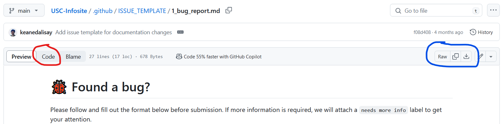

# How to create an issue?

[GitHub has their own documentation on how to create one](https://docs.github.com/en/issues/tracking-your-work-with-issues/creating-an-issue#creating-an-issue-from-a-repository). 

In this guide, we will go over the process of including templates for your issue description.

> [!NOTE]
> We are not using GitHub's form schema syntax. All of our issue and pull request templates are written in Markdown. 

1. If templates exist, open one of them when creating a new issue. 

2. When the template has loaded, click the button with the text `Code` (encircled in red) to display the raw template. Alternatively, you can download the file instead (encircled with blue). 

3. Copy the raw content of the template. 

4. Go back to the new issues page and click the `Open a blank issue` link.

5. Paste the text on the issue description. Add a title and label/s for the issue. 