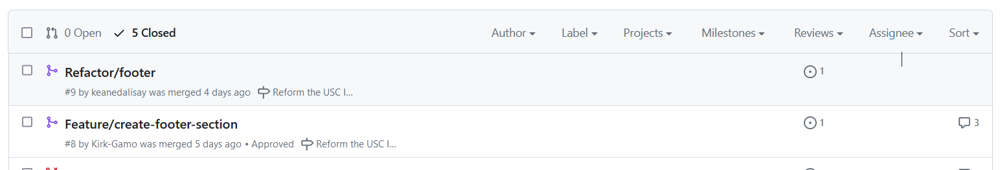
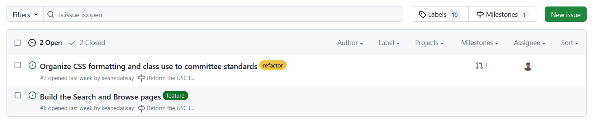

# How to submit a pull request?

[GitHub has their own guide on how to submit one](https://docs.github.com/en/pull-requests/collaborating-with-pull-requests/proposing-changes-to-your-work-with-pull-requests/creating-a-pull-request?tool=webui).

The rest of the document is to guide you on how we handle pull requests for the committee's existing projects.

## Branch and pull request naming

This is how we name branches and their corresponding pull requests: `[label]/[title]`

The label names should be linked to the dominating label of the issue. Usually an issue is dominated either as a:

- `feature`
- `bug`
- `documetation` or `docs`
- `refactor` 

Examples may look like this:

- `feature/new-feature-name`
- `bug/fix-something`
- `docs/ammend-doc`
- `refactor/refactor-something`

> [!NOTE]
> The first letter of the branch name is capitalized for the pull request title.

## An issue must exist before the pull request

If the issue does not exist, [create one](how_to_create_an_issue.md). Each issue should have one person assigned and one branch should be created for that specific issue.

> [!WARNING]
> We will reject pull requests without binding issues. What you want to push to the main branch should be discussed first and approved by the members of the committee.

